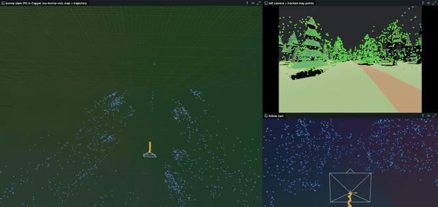

# Integrations

## Copper

[cu-kornia-vio](https://github.com/kornia/cu-kornia-vio) wraps kornia-slam's stereo
visual-inertial odometry as [Copper](https://github.com/copper-project/copper-rs) tasks:

- `StereoVio` takes a `StereoPair` and emits one `VioPose` (camera in world) per solved frame.
- `ImuFeed<N>` pushes `ImuBatch<N>` samples into the shared `VioBus` resource that `StereoVio`
  drains.
- The wire types live in the separate `cu-stereo-payloads` crate, so a camera driver can produce
  them without depending on kornia-slam.



<sub>Stereo + IMU inside Copper's `cu_flight_controller` drone simulator, at 2× speed. Dots on the
camera image are the tracker's map points projected through the estimated pose.</sub>

### Dependencies

Name both crates with the identical git spec:

```toml
[dependencies]
cu-kornia-vio = { git = "https://github.com/kornia/cu-kornia-vio", branch = "main" }
cu-stereo-payloads = { git = "https://github.com/kornia/cu-kornia-vio", branch = "main" }
```

`cu-kornia-vio` pins its copper-rs crates by git `rev`. Inside the copper-rs workspace itself,
where those crates are path dependencies, redirect the pinned git source to the local paths.
Otherwise the graph ends up with two `CuMsg` types:

```toml
# copper-rs/Cargo.toml
[patch."https://github.com/copper-project/copper-rs"]
cu29 = { path = "core/cu29" }
cu29-build = { path = "core/cu29_build" }
cu29-export = { path = "core/cu29_export" }
cu-sensor-payloads = { path = "components/payloads/cu_sensor_payloads" }
cu-spatial-payloads = { path = "components/payloads/cu_spatial_payloads" }
```

`cu-kornia-vio` currently builds against kornia-slam `294b00b`, not `main` HEAD. A new lockfile
resolves HEAD, so pin both repos to the revisions in `cu-kornia-vio`'s own `Cargo.lock`:

```bash
cargo update -p kornia-slam --precise 294b00b14860b79dd0e1c11ba86de9f06f2b0227
cargo update -p kornia-3d --precise 5214f3a437b9f269c0ffc137956a99d58c6ee0c0
```

### Graph

```ron
resources: [ ( id: "vio_bus", provider: "cu_kornia_vio::VioBus" ) ],
tasks: [
    ( id: "imu_feed", type: "cu_kornia_vio::ImuFeed<32>",
      resources: { "imu": "vio_bus.imu" } ),
    ( id: "vio", type: "cu_kornia_vio::StereoVio", background: true,
      config: {
          "inertial": (
              // X_imu = R_BC * X_cam + t_BC; cam is the rectified left camera. Row-major.
              t_bc_rotation: [1.0, 0.0, 0.0,  0.0, -1.0, 0.0,  0.0, 0.0, -1.0],
              t_bc_translation: [-0.06, 0.08, -0.16],
              gyro_noise: 1.7e-4,       // rad/s/sqrt(Hz)
              accel_noise: 2.0e-3,      // m/s^2/sqrt(Hz)
              gyro_bias_noise: 1.9e-5,  // rad/s^2/sqrt(Hz)
              accel_bias_noise: 3.0e-3, // m/s^3/sqrt(Hz)
              rate_hz: 200.0,
              enable_inertial_ba: true,
          ),
      },
      resources: { "imu": "vio_bus.imu", "epoch": "vio_bus.reset_epoch" } ),
],
cnx: [
    ( src: "stereo", dst: "vio", msg: "cu_stereo_payloads::StereoPair" ),
    ( src: "imu", dst: "imu_feed", msg: "cu_stereo_payloads::ImuBatch<32>" ),
    ( src: "vio", dst: "poses", msg: "cu_stereo_payloads::VioPose" ),
],
```

The extrinsic and noise values above belong to one rig; measure your own. Leave out the
`inertial` block for stereo-only tracking.

### Feeding it

- **Stereo:** rectified GRAY8 eyes with their `RectifiedStereo` intrinsics and baseline.
  Emit each captured pair once, with the message `tov` set to the capture time. Re-publishing the
  latest frame every cycle with the cycle time silently skews the camera–IMU alignment.
- **IMU:** samples in the IMU's own axes, each with its capture `tov` on the same clock as the
  images. Accelerations are specific force (`a − g`, about +9.81 m/s² up at rest).
- **Timing matters more than anything else on the inertial path.** In the Copper drone
  simulator, a 16 ms image-stamp error made stereo + IMU worse than stereo alone. Fixing it
  brought ATE from 9.7 m to 2.1 m over a 440 m flight (stereo only: 5.7 m). Simulators that read
  images back from the GPU deliver them one or more render frames late, so stamp the render time.

### Copper runtime settings

- **Simulation:** Copper replaces sinks with placeholders in `sim_mode`. Set `run_in_sim: true` on
  `ImuFeed` and on any pose consumer that must actually run.
- **Keyframe logging:** with `background: true`, a keyframe taken while `StereoVio` is mid-solve
  serializes the pending stereo pair. The first time that happens the keyframe buffer overflows
  (`Failed to serialize task: UnexpectedEnd`). Until that is fixed upstream, set
  `enable_keyframe_logging: false` in the subsystem's `logging` block.
- **Log volume:** task logging of raw image sources at high cycle rates writes gigabytes per
  minute. Disable it on the camera source and on image adapters unless you need replay.

For a self-contained graph on synthetic input, see `examples/stereo_vio.ron` in
[cu-kornia-vio](https://github.com/kornia/cu-kornia-vio).
