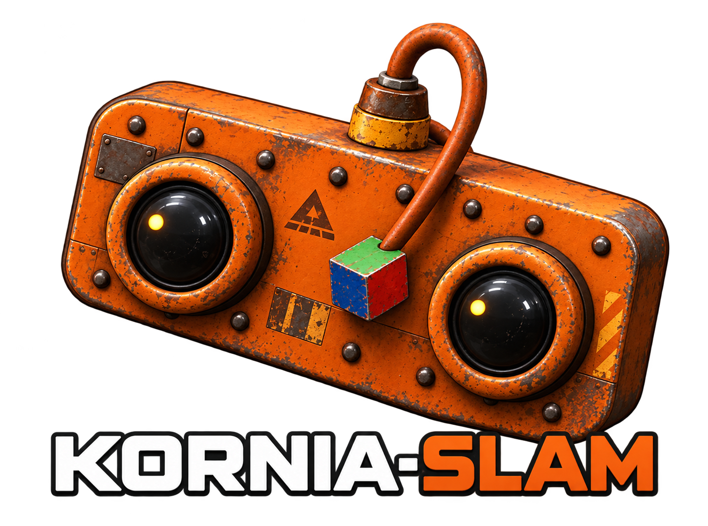

<div align="center">



# kornia-slam

Real-time visual-inertial SLAM in Rust, built on [kornia-rs](https://github.com/kornia/kornia-rs).

</div>

> **v0.1 — early release.** The API will change between minor versions.

## Features

- Monocular, stereo, and visual-inertial ORB SLAM
- Local bundle adjustment, including visual-inertial BA
- Place recognition (DBoW2) and loop closure with pose-graph optimization
- Sources: EuRoC, Hilti, MCAP, OAK-D, UVC webcams
- Terminal UI, Rerun streaming, ATE/RPE evaluation

See [ROADMAP.md](ROADMAP.md) for what's next.

## Quick start

Download a [EuRoC](https://projects.asl.ethz.ch/datasets/doku.php?id=kmavvisualinertialdatasets)
sequence (ASL format), then:

```bash
# monocular
cargo run --release -p kornia-slam-app -- euroc --data /path/to/MH_01_easy

# stereo + IMU, with evaluation against ground truth
cargo run --release -p kornia-slam-app -- euroc --data /path/to/MH_01_easy --stereo --imu --evaluate
```

More sources and options: [apps/kornia-slam-app](apps/kornia-slam-app/README.md).

## Development

With [Pixi](https://pixi.sh), which sets up the toolchain for you:

```bash
pixi run rust-lint           # fmt + clippy + check
pixi run rust-test           # workspace tests
pixi shell                   # drop into the environment
```

Or with a Rust toolchain (1.85+) installed yourself:

```bash
cargo fmt --all -- --check
cargo clippy --all-targets -- -D warnings
cargo test --workspace
```

## License

Apache-2.0
