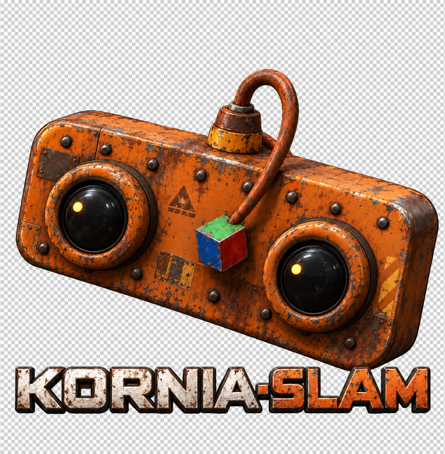
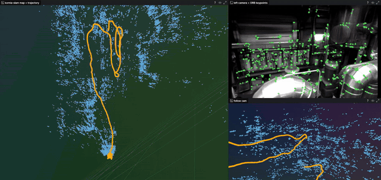
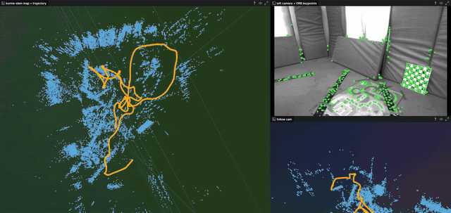

<div align="center">



# kornia-slam

Real-time visual-inertial SLAM in Rust, built on [kornia-rs](https://github.com/kornia/kornia-rs).

</div>

> **v0.1 — early release.** The API will change between minor versions.

<table>
  <tr>
    <td></td>
    <td></td>
  </tr>
  <tr>
    <td align="center">EuRoC MH_01_easy</td>
    <td align="center">EuRoC V1_01_easy</td>
  </tr>
</table>

<sub>Stereo + IMU at 2× speed. Each shows the map and trajectory, the left camera with its ORB
keypoints, and a follow view.</sub>

## Features

- Monocular, stereo, and visual-inertial ORB SLAM
- Local bundle adjustment, including visual-inertial BA
- Place recognition (DBoW2) and loop closure with pose-graph optimization
- Sources: EuRoC, Hilti, MCAP, OAK-D, UVC webcams
- Terminal UI, Rerun streaming, ATE/RPE evaluation

See [ROADMAP.md](ROADMAP.md) for what's next.

## Quick start

Download a [EuRoC](https://projects.asl.ethz.ch/datasets/doku.php?id=kmavvisualinertialdatasets)
sequence (ASL format), then:

```bash
# monocular
cargo run --release -p kornia-slam-app -- euroc --data /path/to/MH_01_easy

# stereo + IMU, with evaluation against ground truth
cargo run --release -p kornia-slam-app -- euroc --data /path/to/MH_01_easy --stereo --imu --evaluate
```

More sources and options: [apps/kornia-slam-app](apps/kornia-slam-app/README.md).

## Integrations

- **[Copper](https://github.com/copper-project/copper-rs):** stereo visual-inertial odometry as
  Copper tasks via [cu-kornia-vio](https://github.com/kornia/cu-kornia-vio). See
  [INTEGRATIONS.md](INTEGRATIONS.md#copper) for setup, graph wiring and timing requirements.

## Development

With [Pixi](https://pixi.sh), which sets up the toolchain for you:

```bash
pixi run rust-lint           # fmt + clippy + check
pixi run rust-test           # workspace tests
pixi shell                   # drop into the environment
```

Or with a Rust toolchain (1.91+; the library crates alone need 1.89) installed yourself:

```bash
cargo fmt --all -- --check
cargo clippy --all-targets -- -D warnings
cargo test --workspace
```

## Paper

**Kornia-SLAM: An End-to-End Visual-Inertial SLAM System in Rust**\
Christie J. Purackal, Edgar Riba, Astik Srivastava.\
Rust for Robotics workshop at IROS 2026 (preprint).\
[Paper (PDF)](https://github.com/kornia/kornia-slam/releases/download/v0.1.0/kornia-slam-iros2026-r4r-paper.pdf) · [Poster (PDF)](https://github.com/kornia/kornia-slam/releases/download/v0.1.0/kornia-slam-iros2026-r4r-poster.pdf)

The paper's EuRoC results come from the August 2026 code, before v0.1.0. To cite
kornia-slam, use GitHub's "Cite this repository" button, which reads
[CITATION.cff](CITATION.cff).

## License

Apache-2.0
